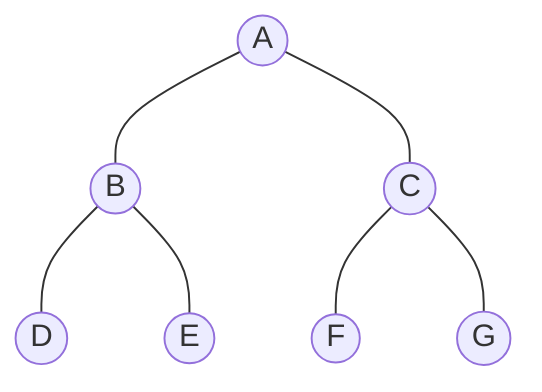

# BFS and DFS Graph Traversal using Python

**Student:** Sanket Subhash Patil  
**Project:** Breadth First Search (BFS) and Depth First Search (DFS)  
**Language:** Python  
**IDE/Tool:** Spyder (Anaconda / Python)  

## Aim
To implement and demonstrate BFS and DFS graph traversal algorithms using Python.

## Graph Used



### Adjacency representation
```text
A -> B, C
B -> A, D, E
C -> A, F, G
D -> B
E -> B
F -> C
G -> C
```

## BFS
BFS visits vertices level by level using a queue.

Starting from `A`:
```text
A -> B -> C -> D -> E -> F -> G
```

## DFS
DFS explores one branch as deeply as possible before backtracking. It can use recursion or a stack.

Starting from `A`:
```text
A -> B -> D -> E -> C -> F -> G
```

## How to Run in Spyder
1. Open Spyder.
2. Create/open `bfs_dfs.py`.
3. Run the program using **F5**.
4. Enter the starting vertex if prompted.
5. Observe BFS and DFS output in the console.

## Complexity
| Algorithm | Time | Space |
|---|---:|---:|
| BFS | O(V + E) | O(V) |
| DFS | O(V + E) | O(V) |

`V` = vertices and `E` = edges.

## Files
- `bfs_dfs.py` - Python implementation of BFS and DFS.
- `CONTRIBUTION_LOG.md` - Contribution/work log.
- `graph.png` - Graph visualization (if generated locally in Spyder).

## Conclusion
BFS and DFS are fundamental graph traversal algorithms. BFS is useful for level-wise traversal and shortest paths in unweighted graphs, while DFS is useful for deep exploration, connected components, and cycle-related problems.
